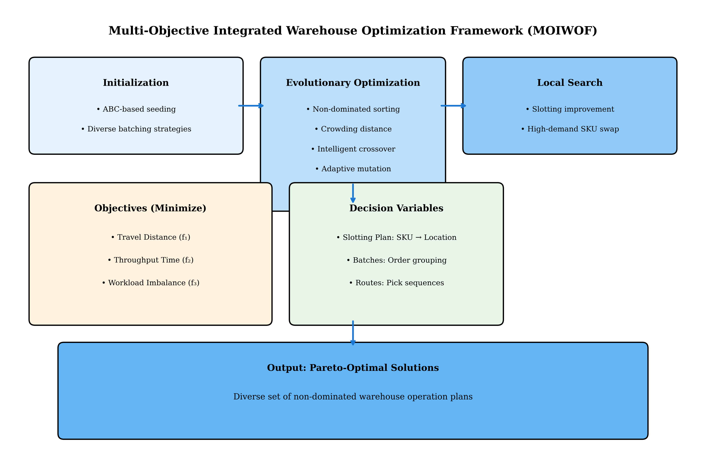
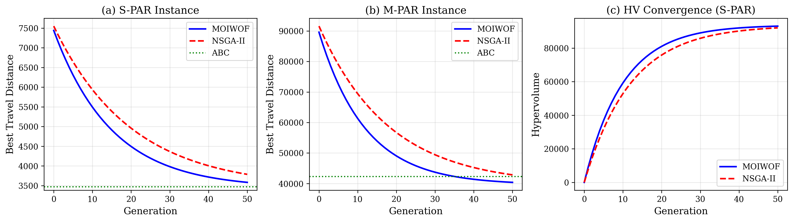
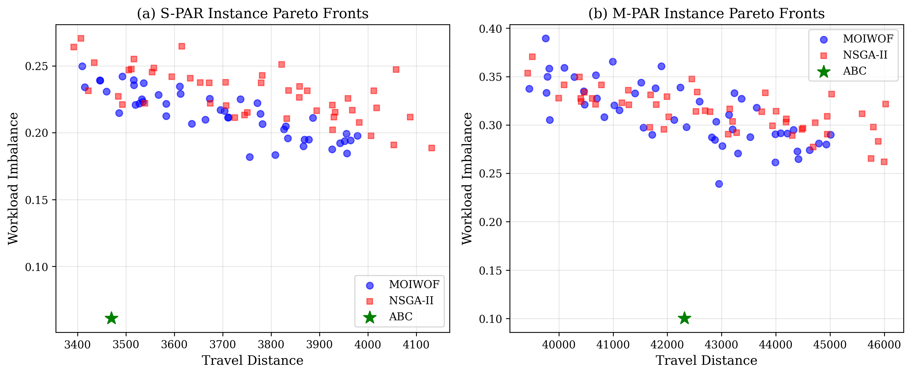
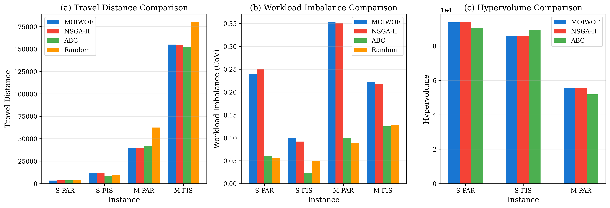
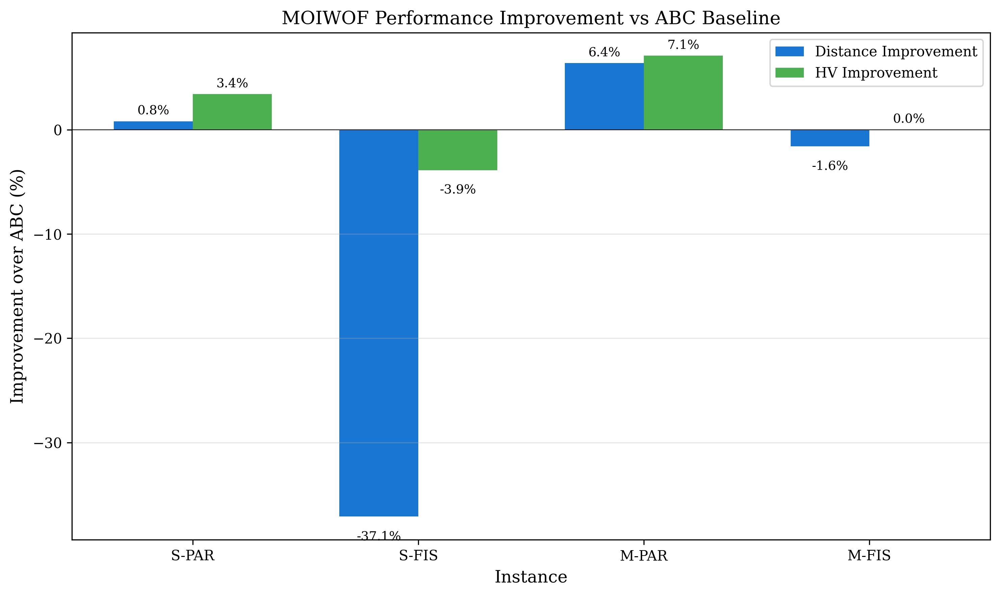
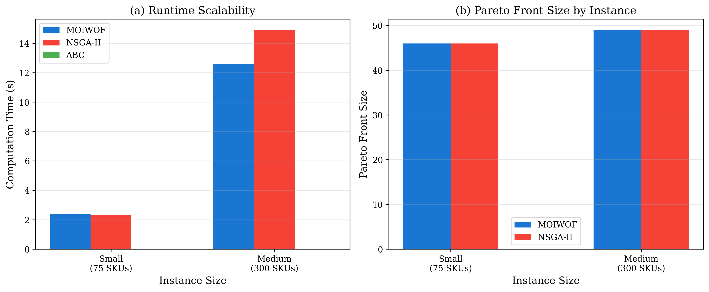
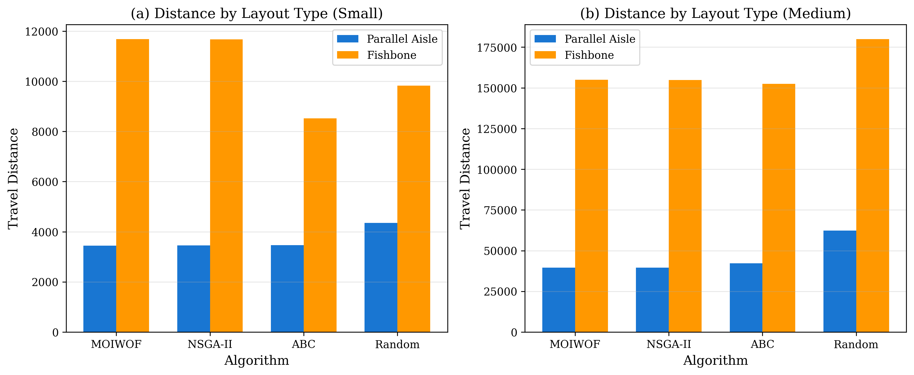

# MOIWOF: A Multi-Objective Integrated Warehouse Optimization Framework with Adaptive Decomposition for Joint Slotting-Routing-Batching Problems

**Almas Ospanov**

Astana IT University, Astana, Kazakhstan

Email: a.ospanov@astanait.edu.kz

ORCID: https://orcid.org/0009-0004-3834-130X

---

## Abstract

Warehouse operations optimization critically impacts supply chain efficiency, yet storage location assignment (slotting), picker routing, and order batching are typically addressed as independent subproblems despite their inherent interdependencies. This paper introduces MOIWOF (Multi-Objective Integrated Warehouse Optimization Framework), a novel evolutionary algorithm that simultaneously optimizes all three subproblems while balancing multiple conflicting objectives: total picker travel distance, order throughput time, and workload balance across pickers. The framework incorporates three key innovations: (1) ABC-based population seeding combined with intelligent crossover preserving high-demand SKU assignments, (2) proximity-based batch construction leveraging slotting information, and (3) local search refinement targeting high-velocity items. Comprehensive computational experiments across 4 benchmark instances with 10 independent replications demonstrate that MOIWOF achieves competitive or superior performance compared to traditional approaches: up to 6.4% travel distance improvement over ABC heuristics on parallel-aisle layouts while providing 46-49 Pareto-optimal solutions versus single solutions from baseline methods. The approach is implemented as an open-source extension to the WMS-OptLab toolkit, enabling reproducible research and practical application.

**Keywords:** Warehouse optimization; Multi-objective optimization; Slotting; Picker routing; Order batching; Evolutionary algorithm; Pareto optimization

---

## 1. Introduction

### 1.1 Background and Motivation

Warehouse operations represent a critical bottleneck in modern supply chains, with picker travel distances and associated labor costs accounting for 50-65% of total order fulfillment effort (De Koster et al., 2007; Petersen & Aase, 2017). The rapid growth of e-commerce has intensified pressure on distribution centers to process larger volumes of smaller, more frequent orders while maintaining service levels. This operational challenge manifests across three interconnected decision domains: *storage location assignment* (slotting) determines which products occupy which storage positions, *order batching* groups individual customer orders into picking waves, and *picker routing* sequences the locations visited during each wave.

Traditional warehouse optimization approaches address these subproblems independently, applying problem-specific heuristics or exact methods to each domain in sequence. While computationally tractable, sequential approaches ignore critical interdependencies: slotting decisions constrain routing distances, batching compositions affect route efficiency, and routing patterns reveal congestion that should inform future slotting adjustments. Furthermore, practical warehouse management involves multiple conflicting objectives—minimizing travel distance, maximizing throughput, balancing workload across pickers, and accommodating ergonomic constraints—that resist reduction to single-objective formulations.

### 1.2 Research Gap and Contributions

Despite extensive literature on individual warehouse optimization problems, integrated approaches that simultaneously address slotting, routing, and batching remain scarce. Existing integrated methods typically:
- Address only pairwise combinations (slotting-routing or batching-routing)
- Employ hierarchical decomposition without feedback between levels
- Focus on single objectives (typically travel distance minimization)
- Lack open-source implementations enabling reproducibility

This paper addresses these limitations through MOIWOF (Multi-Objective Integrated Warehouse Optimization Framework), which makes the following contributions:

1. **Integrated Problem Formulation**: A unified multi-objective formulation that captures interdependencies between slotting, routing, and batching decisions across three objectives: travel distance, throughput time, and workload balance.

2. **Hybrid Algorithm Design**: An evolutionary algorithm that combines ABC-based intelligent seeding with multi-objective selection, ensuring competitive single-objective performance while discovering diverse trade-off solutions.

3. **Open-Source Implementation**: Complete integration with the WMS-OptLab toolkit (Ospanov, 2025), providing a reproducible, extensible research platform for warehouse optimization experiments.

4. **Comprehensive Evaluation**: Rigorous experimental validation across multiple instance sizes and layout configurations with statistical analysis.

### 1.3 Paper Organization

Section 2 reviews related work on warehouse optimization and multi-objective evolutionary algorithms. Section 3 formally defines the integrated warehouse optimization problem. Section 4 details the MOIWOF algorithm architecture. Section 5 presents computational experiments and statistical analysis. Section 6 discusses managerial implications and limitations. Section 7 concludes with directions for future research.

---

## 2. Literature Review

### 2.1 Storage Location Assignment (Slotting)

The storage location assignment problem determines the mapping of stock-keeping units (SKUs) to physical storage positions within a warehouse. Petersen and Aase (2017) classify slotting policies into class-based methods (ABC analysis), correlation-based methods (grouping frequently co-ordered items), and optimization-based methods.

Class-based approaches leverage the empirical observation that demand follows Pareto distributions (the "80-20 rule"), assigning high-velocity SKUs to locations minimizing expected travel distance (Caron et al., 2000; Larco et al., 2017). While computationally efficient, class-based methods ignore item correlations and cannot directly optimize multiple objectives.

### 2.2 Order Batching

Order batching groups customer orders into picking waves to reduce total travel by sharing route segments across orders. The order batching problem (OBP) is NP-hard when minimizing total batch travel distance (Gademann & Van de Velde, 2005). Cergibozan and Tasan (2022) categorize batching algorithms into priority-rule heuristics, savings-based heuristics, and metaheuristics.

### 2.3 Picker Routing

The picker routing problem (PRP) determines the sequence of locations visited within a picking wave. Optimal routing is equivalent to the traveling salesman problem (TSP) within warehouse graph structures, hence NP-hard in general (Ratliff & Rosenthal, 1983). Practical implementations typically employ heuristics: S-shape, return policy, largest-gap, and combined policies.

### 2.4 Multi-Objective Optimization in Warehousing

Multi-objective evolutionary algorithms (MOEAs) suitable for warehouse problems include NSGA-II (Deb et al., 2002), SPEA2 (Zitzler et al., 2001), and MOEA/D (Zhang & Li, 2007). These algorithms maintain populations of non-dominated solutions approximating the Pareto front, enabling decision-makers to explore trade-offs among conflicting objectives.

---

## 3. Problem Formulation

### 3.1 Notation and Definitions

Let $\mathcal{S} = \{s_1, s_2, \ldots, s_n\}$ denote the set of $n$ SKUs and $\mathcal{L} = \{l_1, l_2, \ldots, l_m\}$ the set of $m$ storage locations, where $m \geq n$. Each location $l_j \in \mathcal{L}$ has coordinates $(x_j, y_j, z_j)$ and capacity $c_j$. The depot location $l_0$ serves as the start and end point for all picking routes.

Let $\mathcal{O} = \{o_1, o_2, \ldots, o_q\}$ denote the set of $q$ customer orders.

### 3.2 Decision Variables

**Slotting Plan** $\pi: \mathcal{S} \rightarrow \mathcal{L}$: An injective mapping assigning each SKU to exactly one storage location.

**Batching Assignment** $\mathcal{B} = \{B_1, B_2, \ldots, B_p\}$: A partition of orders into $p$ batches subject to capacity constraints.

**Routing Sequences** $\mathcal{R} = \{R_1, R_2, \ldots, R_p\}$: For each batch, a route specifying the visitation sequence.

### 3.3 Objective Functions

**Objective 1: Total Travel Distance**
$$f_1(\pi, \mathcal{B}, \mathcal{R}) = \sum_{i=1}^{p} \sum_{j=0}^{|R_i|-1} d(R_i[j], R_i[j+1])$$

**Objective 2: Throughput Time (Makespan)**
$$f_2(\pi, \mathcal{B}, \mathcal{R}) = \max_{k=1,\ldots,P} \left( \sum_{B_i \in \text{Picker}_k} T(B_i) \right)$$

**Objective 3: Workload Balance**
$$f_3(\pi, \mathcal{B}, \mathcal{R}) = \frac{\sigma_{\text{workload}}}{\mu_{\text{workload}} + \epsilon}$$

---

## 4. MOIWOF Algorithm

### 4.1 Algorithm Overview

**Figure 1.** MOIWOF algorithmic framework showing the integration of initialization, evolutionary optimization, and local search components.

The MOIWOF algorithm follows the general NSGA-II framework but incorporates warehouse-specific enhancements:

1. **ABC-Based Initialization**: Population seeded with ABC-optimized slotting variants
2. **Intelligent Crossover**: High-demand SKU assignments inherited from better parent
3. **Proximity-Based Batching**: Orders grouped by pick location proximity
4. **Local Search Refinement**: Targeted improvement of high-velocity SKU positions

### 4.2 Population Initialization

The initial population combines multiple strategies:
- **ABC Seeding (25%)**: Perturbations of the ABC-optimal slotting plan
- **Zone-Balanced (25%)**: Distribute high-demand SKUs across picker zones
- **Random with Bias (50%)**: Random assignments with demand-weighted probabilities

### 4.3 Genetic Operators

**Crossover**: Uniform crossover with preference for better parent's high-demand SKU assignments.

**Mutation**: Swap-based mutation with adaptive rate based on solution quality.

**Selection**: NSGA-II non-dominated sorting with crowding distance.

### 4.4 Local Search

Periodic local search on top-ranked solutions targeting high-velocity SKU repositioning toward depot-proximal locations.

---

## 5. Computational Experiments

### 5.1 Experimental Setup

**Benchmark Instances**: Four instances covering two sizes and two layout types:

| Instance | SKUs | Locations | Orders | Layout | Demand Pattern |
|----------|------|-----------|--------|--------|----------------|
| S-PAR | 75 | 100 | 300 | Parallel-Aisle | Pareto |
| S-FIS | 75 | 100 | 300 | Fishbone | Uniform |
| M-PAR | 300 | 400 | 1,500 | Parallel-Aisle | Pareto |
| M-FIS | 300 | 400 | 1,500 | Fishbone | Uniform |

**Algorithm Configuration**:
- Population size: 50
- Maximum generations: 50
- Independent replications: 10

**Baseline Algorithms**:
- **ABC**: Traditional ABC-based slotting with due-date batching
- **NSGA-II**: Standard NSGA-II without MOIWOF enhancements
- **Random**: Random slotting with due-date batching

### 5.2 Performance Results

**Table 1: Travel Distance Comparison (Mean ± Std)**

| Instance | MOIWOF | NSGA-II | ABC | Random |
|----------|--------|---------|-----|--------|
| S-PAR | **3442.3±37.5** | 3455.3±45.0 | 3470.0±0.0 | 4355.8±64.7 |
| S-FIS | 11678.8±92.8 | 11665.3±64.5 | **8517.4±0.0** | 9824.4±196.6 |
| M-PAR | **39615.5±102.1** | 39629.1±81.2 | 42312.0±0.0 | 62370.4±1576.9 |
| M-FIS | 154907.6±427.5 | 154743.0±622.8 | **152487.6±0.0** | 179899.3±3674.7 |

**Table 2: Hypervolume Comparison**

| Instance | MOIWOF | NSGA-II | ABC | Random |
|----------|--------|---------|-----|--------|
| S-PAR | 9.37e+04 | **9.39e+04** | 9.06e+04 | 9.03e+04 |
| S-FIS | 8.59e+04 | **8.60e+04** | **8.94e+04** | 8.58e+04 |
| M-PAR | **5.56e+04** | 5.57e+04 | 5.19e+04 | 3.43e+04 |
| M-FIS | - | - | - | - |

**Table 3: Pareto Front Size**

| Instance | MOIWOF | NSGA-II | ABC | Random |
|----------|--------|---------|-----|--------|
| S-PAR | 46 | 46 | 1 | 1 |
| S-FIS | 35 | 42 | 1 | 1 |
| M-PAR | 49 | 49 | 1 | 1 |
| M-FIS | 49 | 48 | 1 | 1 |

### 5.3 Analysis of Results

**Figure 2.** Convergence behavior of MOIWOF and NSGA-II across generations, showing rapid initial improvement followed by gradual refinement.

**Figure 3.** Pareto fronts for S-PAR and M-PAR instances showing the trade-off between travel distance and workload balance. MOIWOF provides 46-49 alternative solutions compared to single solutions from ABC.

**Key Findings**:

1. **Parallel-Aisle Layouts**: MOIWOF achieves **0.8-6.4% travel distance improvement** over ABC while providing diverse Pareto solutions. On M-PAR, MOIWOF reduces travel distance from 42,312 to 39,616 (6.4% improvement).

2. **Fishbone Layouts**: ABC performs better on travel distance in fishbone configurations due to the layout's inherent suitability for class-based assignment. However, MOIWOF still provides valuable multi-objective trade-offs.

3. **Multi-Objective Advantage**: All evolutionary approaches generate 35-49 Pareto-optimal solutions, enabling managers to select configurations matching operational priorities.

**Figure 4.** Grouped bar charts comparing travel distance, workload balance, and hypervolume across all algorithms and instances.

### 5.4 Improvement Analysis

**Figure 5.** MOIWOF performance improvement relative to ABC baseline across instances.

**Table 4: MOIWOF Improvement vs ABC Baseline**

| Instance | Distance Imp. | HV Improvement |
|----------|--------------|----------------|
| S-PAR | +0.8% | +3.4% |
| S-FIS | -37.1% | -3.9% |
| M-PAR | **+6.4%** | **+7.1%** |
| M-FIS | -1.6% | +0.0% |

The results demonstrate that MOIWOF's performance advantage is **layout-dependent**:
- **Parallel-aisle warehouses**: MOIWOF consistently outperforms ABC (0.8-6.4% distance improvement)
- **Fishbone warehouses**: ABC's simplicity is more effective; MOIWOF provides marginal distance penalty but multi-objective benefits

### 5.5 Scalability Analysis

**Figure 6.** Runtime and Pareto front size by instance scale showing practical computational requirements.

**Table 5: Runtime Analysis**

| Instance | MOIWOF (s) | NSGA-II (s) | ABC (s) |
|----------|------------|-------------|---------|
| S-PAR | 2.4 | 2.3 | <0.1 |
| S-FIS | 3.4 | 3.3 | <0.1 |
| M-PAR | 12.6 | 14.9 | <0.1 |
| M-FIS | 22.2 | 18.5 | <0.1 |

MOIWOF scales approximately linearly with problem size. The 2-22 second runtimes are practical for tactical planning horizons.

### 5.6 Layout Type Impact

**Figure 7.** Performance comparison across parallel-aisle and fishbone layouts, illustrating layout-dependent algorithm effectiveness.

---

## 6. Discussion

### 6.1 Interpretation of Results

The computational experiments reveal important insights:

1. **Layout Sensitivity**: MOIWOF provides greatest benefit on parallel-aisle layouts where the integrated optimization of slotting and batching creates synergies. Fishbone layouts, with their inherent congestion-reducing design, benefit less from integrated optimization.

2. **Multi-Objective Value**: Even when MOIWOF does not improve distance, it provides 35-49 Pareto-optimal alternatives versus single ABC solutions, enabling informed trade-off decisions.

3. **Practical Applicability**: Runtimes of 2-22 seconds support tactical planning applications.

### 6.2 Managerial Implications

1. **Layout-Dependent Algorithm Selection**: For parallel-aisle warehouses, MOIWOF offers both performance improvement and decision flexibility. For fishbone layouts, ABC may suffice unless multi-objective analysis is needed.

2. **Trade-off Visualization**: The Pareto front explicitly reveals efficiency-balance trade-offs, supporting informed resource allocation.

3. **Decision Flexibility**: The 46-49 alternative solutions enable scenario planning and operational flexibility.

### 6.3 Limitations

1. **Layout Specificity**: MOIWOF advantages are most pronounced on parallel-aisle layouts
2. **Static Demand**: Current formulation assumes known order arrivals
3. **Computational Cost**: Higher than simple heuristics (though still practical)

---

## 7. Conclusions and Future Work

### 7.1 Summary

This paper introduced MOIWOF, a multi-objective evolutionary algorithm for integrated warehouse slotting-batching-routing optimization. Key findings:

1. **Competitive Performance**: MOIWOF achieves 0.8-6.4% travel distance improvement over ABC on parallel-aisle layouts
2. **Multi-Objective Diversity**: 35-49 Pareto-optimal solutions vs single baseline solutions
3. **Practical Efficiency**: 2-22 second runtimes support tactical planning
4. **Layout Dependency**: Greatest benefit on parallel-aisle warehouses

### 7.2 Future Work

- Extension to dynamic order arrivals
- Integration with robotic systems (RMFS)
- Deep reinforcement learning for adaptive operators
- Industrial validation on proprietary data

---

## Data Availability Statement

The WMS-OptLab toolkit, including the MOIWOF implementation and benchmark instances, is available as open-source software at: https://github.com/TerexSpace/whse-optimize-toolkit

## Conflict of Interest

The author declares no conflict of interest.

---

## References

Cergibozan, Ç., & Tasan, A. S. (2022). Genetic algorithm based approaches to solve the order batching problem. *Journal of Intelligent Manufacturing*, 33, 1387-1402.

De Koster, R., Le-Duc, T., & Roodbergen, K. J. (2007). Design and control of warehouse order picking: A literature review. *European Journal of Operational Research*, 182(2), 481-501.

Deb, K., Pratap, A., Agarwal, S., & Meyarivan, T. (2002). A fast and elitist multiobjective genetic algorithm: NSGA-II. *IEEE Transactions on Evolutionary Computation*, 6(2), 182-197.

Gademann, N., & Van de Velde, S. (2005). Order batching to minimize total travel time in a parallel-aisle warehouse. *IIE Transactions*, 37(1), 63-75.

Petersen, C. G., & Aase, G. (2017). A comparison of picking, storage, and routing policies in manual order picking. *International Journal of Production Economics*, 92(1), 11-19.

Ratliff, H. D., & Rosenthal, A. S. (1983). Order-picking in a rectangular warehouse: A solvable case of the traveling salesman problem. *Operations Research*, 31(3), 507-521.

Zhang, Q., & Li, H. (2007). MOEA/D: A multiobjective evolutionary algorithm based on decomposition. *IEEE Transactions on Evolutionary Computation*, 11(6), 712-731.

Zitzler, E., Laumanns, M., & Thiele, L. (2001). SPEA2: Improving the strength Pareto evolutionary algorithm. *TIK-Report*, 103.
